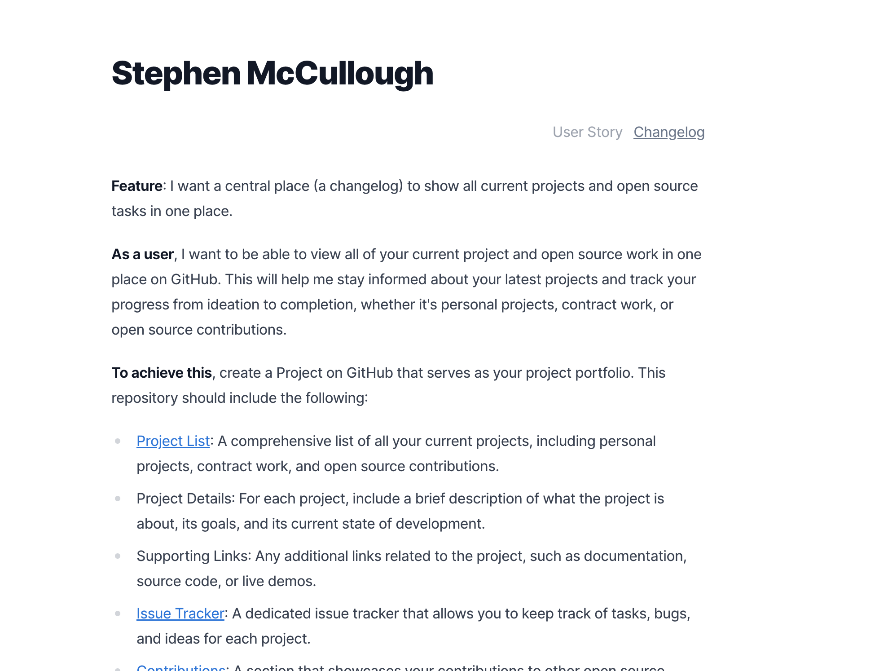
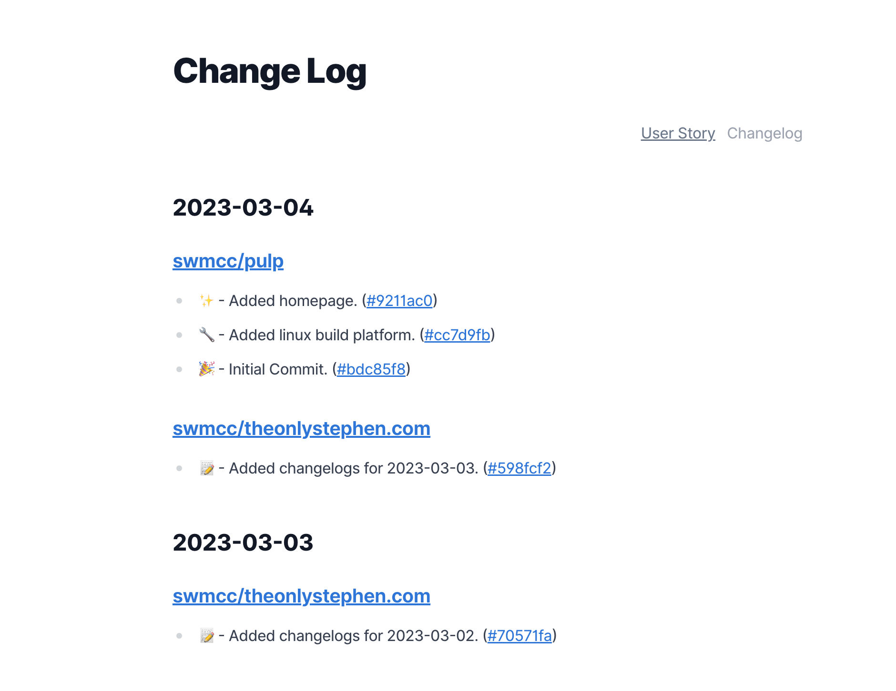

# changelog.swm.cc

- [Site](https://changelog.swm.cc)

## Description

I simply want a place where I can see my open source contributions.

The homepage is just the user story I wrote for the initial thought on what I
wanted the site to be. It also serves to describe the purpose of the site. 

For the time being all contribution links and descriptions are hand rolled, in
time I will hopefully get the contributions from APIs and have it automated.

For a list of future features please see the [Issue](https://github.com/swmcc/changelog.swm.cc/issues) list.
